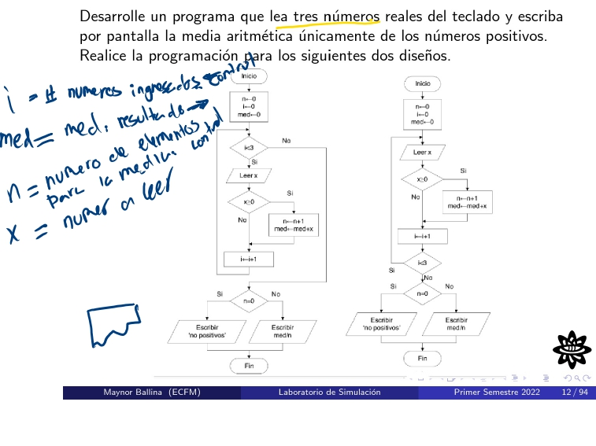
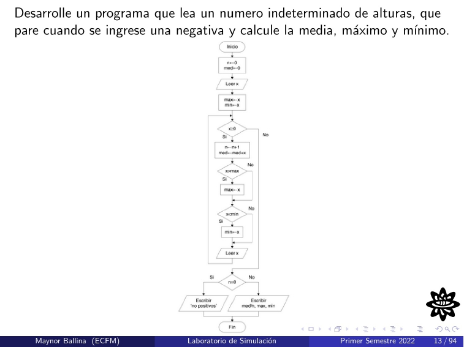
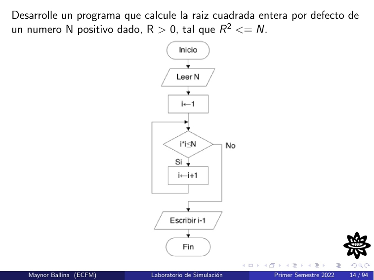
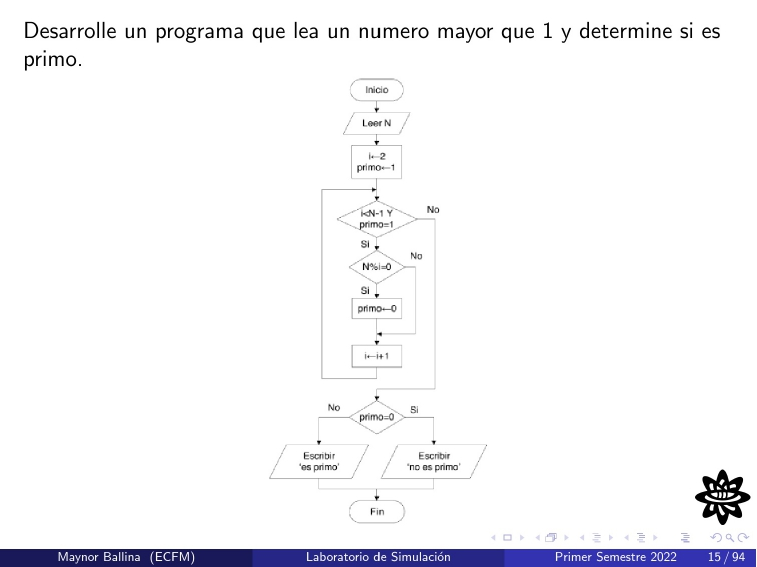
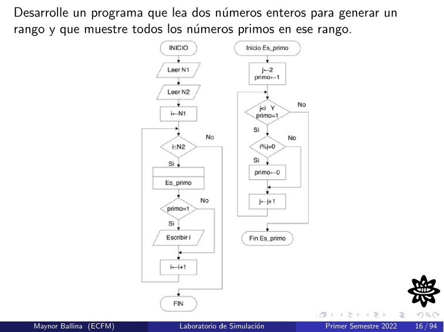

# PROBLEMAS DE PROGRAMACION
Dentro de esta carpeta se documentaran los problemas de programacion dejados en clase.
### PROBLEMA 1

Variables:
 - i: Variable de control tipo entero, permite realizar las iteraciones del ciclo while.
 - n: Variable de control tipo entero, que almacena la cantidad de numeros positivos ingresados.
 - x: Variable de entrada tipo coma flotante, que almacena el numero ingresado por el usuario.
 - suma: Variable de salida tipo coma flotante, que almacena la suma iterativa de numeros positivos ingresado.

Compilacion y ejecucion
```
$ gcc -o problema1.out problema1.c
```
### PROBLEMA 2

Variables:
 - n: Variable de control tipo entero, permite realizar las iteraciones del ciclo while para solicitar la siguiente altura.
 - x: Variable de entrada tipo coma flotante, que almacena el numero ingresado por el usuario.
 - med: Variable de salida tipo coma flotante, que almacena la suma iterativa de numeros positivos ingresado.
 - min: Variable de salida tipo coma flotante, que almacena el minimo valor de altura ingrasado.
 - max: Variable de salida tipo como flotante, que almacena el maximo valor de altura ingresado.

Compilacion y ejecucion
```
$ gcc -o problema2.out problema2.c
```
### PROBLEMA 3

Variables:
 - i: Variable de control tipo entero, permite realizar las iteraciones del ciclo while.
 - R: Variable de control tipo entero, que almacena el valor entero superior o inferior a la raiz cuadrada busacada.
 - N: Variable de entrada tipo coma flotante, que almacena el numero ingresado por el usuario.

Compilacion y ejecucion
```
$ gcc -o problema3out problema3.c
```


### PROBLEMA 4

Variables:
 - i: Variable de control tipo entero, permite realizar las iteraciones del ciclo while.
 - primo: Variable de control tipo entero, que permite decidir si el numero ingresado es primo o no, representando un residuo cero.
 - N: Variable de entrada tipo entero, que almacena el numero ingresado por el usuario.

Compilacion y ejecucion
```
$ gcc -o problema4.out problema4.c
```

### PROBLEMA 5

Variables:
 - i: 

Compilacion y ejecucion
```
$ gcc -o problema5.out problema5.c
```
