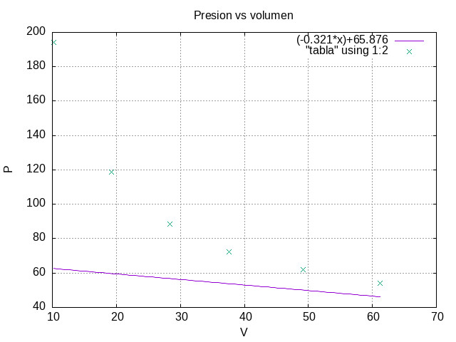

## SEGUNDO PARCIAL 
Esta carpeta contiene los archivos compilables del programa para obtener una correlación lineal de datos de presión y volumen de un material.
# Metodología.
Con los datos brindados, que corresponden a la presión y volumen de un material confinado y aislado, se procede a realizar una regresión lineal, para obtener una ecuación de primer grado como modelo matemático.

Para ello se recurre al método de mínimos cuadrados, para obtener la linealización de los datos.
# Variables y constantes.
    -Se inicializan variables globales de entrada de tipo entero: i, n, para los ciclos de iteración.
    -Se inicializa variable de coma flotante: V, b, m,r,p errorm, errorb, para el valor del volumen con el cual se calcula una presión particular, intercepto de la abscisa, la pendiente de la recta, coeficiente de determinación, presión en función del volumen, error de la pendiente y error del intercepto, respectivamente.
Se prototipan 4 funciones, imprimir1, imprimir2, que imprimen las primeras dos, los valores de las componentes de los vectores utilizados para ingresar los datos de presion y volumen, y las funciones suma y sumaMulti, que desarrollan la suma de las componentes y la suma del producto de las componentes de dichos vectores, necesaria para la regresión por el método de mínimos cuadrados.
# Diagrama de flujo:

# Gráfica con Gnuplot:
Se grafica con Gnuplot, la función lineal obtenida, y los puntos que representan los datos puros de la interacción de las variables presión y volumen. Esto se logra con el compilable grafica.gp
